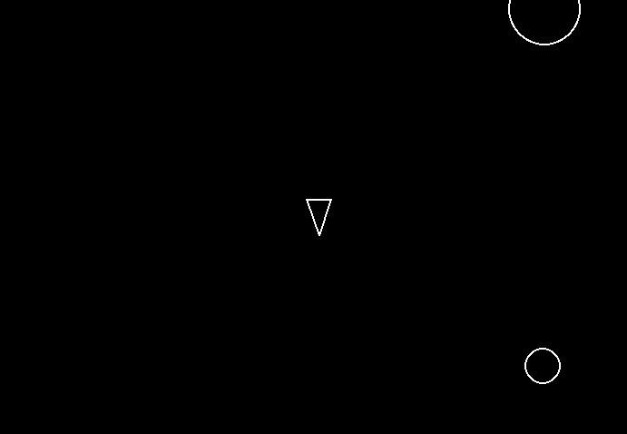

# Asteroids game

## Description

A simple video game, based on the classic Asteroids.

## Technologies Used

- **Backend**:

  - Native Python(At least version 3.10 or higher)
  - Unix shell such as bash or zsh. If you're using windows consider installing git bash.
  - Pygame libary version 2.6+

- **Deployment**:

  - Just run the main.py and enjoy!

## Try my app

1. You can try the app by cloning the repo locally and execute the main.py, make sure you have python3 installed as well as pygame version 2.6+

## Visual reference of project

The following image demonstrates the app's appearance:

## License

This project uses the MIT license.
